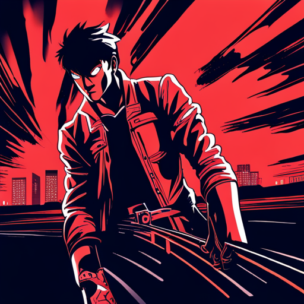

# Story

styleName: animeNoir

styleValue: futuristic film noir anime comic book high contrast illustration style of Akira

# Ginger Intro 

  
at [hosExt] portrait of [ginger] smoking a cigarette

  undefined

Ginger takes a huff on her cigarette and looks around

Ginger: hi Malika

  
[ginger] flanked by her lawyers

  undefined

Ginger leaves the courtroom in a huff, flanked by her lawyers.

  
[ginger] at the [hosSteps] surrounded by reporters and paparazzi photographers

  undefined

Ginger is met with screams and heckles.

She pushes past her two lawyers to a mic-covered podium. Hecklers boo. Her lawyers

Ginger: Move over, boys. They want to see me.

Ginger blows kisses to hecklers as she descends the stairs to a waiting shimmering gold Monocorp JUMPER — an autonomous quadcopter VTOL passenger drone covered in a matrix of marquee bulbs that move in abstract patterns. futuristic film noir anime comic book high contrast illustration

  
[ginger] at the [hosSteps] signing an autograph

  undefined

Ginger signs an autograph for a young seeker, who - in the chaos - is left holding Ginger’s lit cigarette.

# Hopper 1 

  
Snow spirals down from the heavens on the iconic CAPITOL RECORDS BUILDING in Los Angeles.

  undefined

  
a mysterious person in a velvet hooded robe holds a snow globe in the palm of their hand. inside the snow globe is the iconic CAPITOL RECORDS BUILDING.

  undefined

  
CAPITOL RECORDS TOWER - decrepit and abandoned - leans precariously in the background.

  undefined

# Jamal 

  
Jamal pulls out an old photo of him and his girlfriend

  undefined

Jamal pulls out an old photo of him and his girlfriend. In his denim coat, he, too, finds a snow globe: “Life is like a snow globe - it’s most beautiful when shaken up.”

