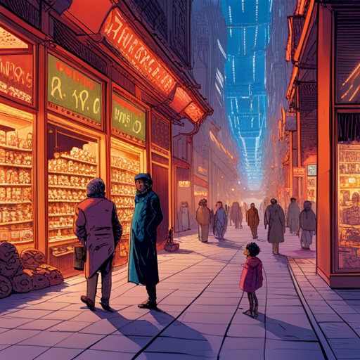

# Story

styleName: retroFuture

styleValue: cover illustration for a graphic novel by Jean Giraud Moebius, the Incal, by Syd Mead. retro future styllish drawing

# Ginger Intro 

  
at [hosExt] portrait of [ginger] smoking a cigarette

  at In front of the building’s Art Deco rotunda and towering curved facade, a media circus of paparazzi, reporters and fans gather behind barricades. portrait of early 30s ethnically ambiguous woman in a red dress wearing Jackie Onassis sunglasses smoking a cigarette

Ginger takes a huff on her cigarette and looks around

Ginger: hi Malika

  
[ginger] flanked by her lawyers

  early 30s ethnically ambiguous woman in a red dress wearing Jackie Onassis sunglasses flanked by her lawyers

Ginger leaves the courtroom in a huff, flanked by her lawyers.

  
[ginger] at the [hosSteps] surrounded by reporters and paparazzi photographers

  early 30s ethnically ambiguous woman in a red dress wearing Jackie Onassis sunglasses at the The steps of the Hall of Justice surrounded by reporters and paparazzi photographers

Ginger is met with screams and heckles.

She pushes past her two lawyers to a mic-covered podium. Hecklers boo. Her lawyers

Ginger: Move over, boys. They want to see me.

Ginger blows kisses to hecklers as she descends the stairs to a waiting shimmering gold Monocorp JUMPER — an autonomous quadcopter VTOL passenger drone covered in a matrix of marquee bulbs that move in abstract patterns. futuristic film noir anime comic book high contrast illustration

  
[ginger] at the [hosSteps] signing an autograph

  early 30s ethnically ambiguous woman in a red dress wearing Jackie Onassis sunglasses at the The steps of the Hall of Justice signing an autograph

Ginger signs an autograph for a young seeker, who - in the chaos - is left holding Ginger’s lit cigarette.

# Hopper 1 

  
Snow spirals down from the heavens on the iconic CAPITOL RECORDS BUILDING in Los Angeles.

  Snow spirals down from the heavens on the iconic CAPITOL RECORDS BUILDING in Los Angeles.

  
a mysterious person in a velvet hooded robe holds a snow globe in the palm of their hand. inside the snow globe is the iconic CAPITOL RECORDS BUILDING.

  a mysterious person in a velvet hooded robe holds a snow globe in the palm of their hand. inside the snow globe is the iconic CAPITOL RECORDS BUILDING.

  
CAPITOL RECORDS TOWER - decrepit and abandoned - leans precariously in the background.

  CAPITOL RECORDS TOWER - decrepit and abandoned - leans precariously in the background.

# Jamal 

  
Jamal pulls out an old photo of him and his girlfriend

  Jamal pulls out an old photo of him and his girlfriend

Jamal pulls out an old photo of him and his girlfriend. In his denim coat, he, too, finds a snow globe: “Life is like a snow globe - it’s most beautiful when shaken up.”

  
[Jamal] walks through a BAZAAR with CHRISTMAS LIGHTS strung up over WET MARKETS and RATIONING BOOTHS.

  [Jamal] walks through a BAZAAR with CHRISTMAS LIGHTS strung up over WET MARKETS and RATIONING BOOTHS.

He walks through a BAZAAR with CHRISTMAS LIGHTS strung up over WET MARKETS and RATIONING BOOTHS.

  
[Jamal] walks through a BAZAAR with CHRISTMAS LIGHTS strung up over WET MARKETS and RATIONING BOOTHS.

  [Jamal] walks through a BAZAAR with CHRISTMAS LIGHTS strung up over WET MARKETS and RATIONING BOOTHS.

A troupe of Mexican performers hunched over dressed in sombreros with streamers, ponchos and masks stomp their feet and canes in a rhythmic do-si-do dance to the beat.

  
A HOVER SCOOTER gang on floating skateboards prowl through the smog looking for victims to rob

  A HOVER SCOOTER gang on floating skateboards prowl through the smog looking for victims to rob

A HOVER SCOOTER gang, led by a thug with a checkerboard face tattoo, prowls through the smog looking for victims.

  
[Jamal] iooks up at the [jumpers] in the sky

  [Jamal] iooks up at the futuristic hover cars flying through the sky in the sky

Jamal is amazed at the Jumpers in the sky. A lot has changed in the ten years he was inside.

  
Jamal is approached by two DRUG DEALERS who wear large turbans and twirl glowing umbrellas that illuminate their ghoulish faces.

  Jamal is approached by two DRUG DEALERS who wear large turbans and twirl glowing umbrellas that illuminate their ghoulish faces.

Two turban-wearing DRUG DEALERS twirl glowing umbrellas that illuminate their ghoulish faces. One opens up his trench coat and reveals drugs. Jamal snatches the bag but doesn’t pay. He’s too big to stop.

  
A scantily-clad mask-wearing lady sells betel nuts from a neon-lit glass kiosk

  A scantily-clad mask-wearing lady sells betel nuts from a neon-lit glass kiosk

A scantily-clad, mask-wearing lady sells betel nuts from a neon-lit glass kiosk. She beckons a passing Jamal.

  
Jamal violently clotheslines a thug with a checkerboard face tattoo on a hover scooter

  Jamal violently clotheslines a thug with a checkerboard face tattoo on a hover scooter

The checkerboard face thug snatches the purse from the betel nut girl. Jamal violently clotheslines him in one motion. Jamal tosses the purse back to the girl then strips the thug of his Money Green Chinchilla fur jacket.

# Board meeting 

  
[monocorp-penthouse] exterior shot

  [monocorp-penthouse] exterior shot

  
board members

  20s-50s, mix genders and ethnicities, epitomizing corporate cool with deadpan stares, smoldering gazes and perfectly coiffed hair singing and dancing

BOARD MEMBERS (20s-50s, mix genders and ethnicities, epitomizing corporate cool with deadpan stares, smoldering gazes and perfectly coiffed hair) dance

