# Story

styleName: retroFuture

styleValue: cover illustration for a graphic novel by Jean Giraud Moebius, the Incal, by Syd Mead. retro future stylish drawing

# Ginger Intro 

  
at [hosExt] portrait of [ginger] smoking a cigarette

  at In front of the building’s Art Deco rotunda and towering curved facade, a media circus of paparazzi, reporters and fans gather behind barricades. portrait of [ginger] smoking a cigarette

Ginger takes a huff on her cigarette and looks around

Tiara: hi Malika

  
[ginger] flanked by her lawyers

  [ginger] flanked by her lawyers

Ginger leaves the courtroom in a huff, flanked by her lawyers.

  
[ginger] at the [hosSteps] surrounded by reporters and paparazzi photographers

  [ginger] at the The steps of the Hall of Justice surrounded by reporters and paparazzi photographers

Ginger is met with screams and heckles.

She pushes past her two lawyers to a mic-covered podium. Hecklers boo. Her lawyers

Tiara: Move over, boys. They want to see me.

Ginger blows kisses to hecklers as she descends the stairs to a waiting shimmering gold Monocorp JUMPER — an autonomous quadcopter VTOL passenger drone covered in a matrix of marquee bulbs that move in abstract patterns. futuristic film noir anime comic book high contrast illustration

  
[ginger] at the [hosSteps] signing an autograph

  [ginger] at the The steps of the Hall of Justice signing an autograph

Ginger signs an autograph for a young seeker, who - in the chaos - is left holding Ginger’s lit cigarette.

# Hopper 1 

  
Snow spirals down from the heavens on the iconic CAPITOL RECORDS BUILDING in Los Angeles.

  Snow spirals down from the heavens on the iconic CAPITOL RECORDS BUILDING in Los Angeles.

  
a mysterious person in a velvet hooded robe holds a snow globe in the palm of their hand. inside the snow globe is the iconic CAPITOL RECORDS BUILDING.

  a mysterious person in a velvet hooded robe holds a snow globe in the palm of their hand. inside the snow globe is the iconic CAPITOL RECORDS BUILDING.

  
CAPITOL RECORDS TOWER - decrepit and abandoned - leans precariously in the background.

  CAPITOL RECORDS TOWER - decrepit and abandoned - leans precariously in the background.

# Jamal 

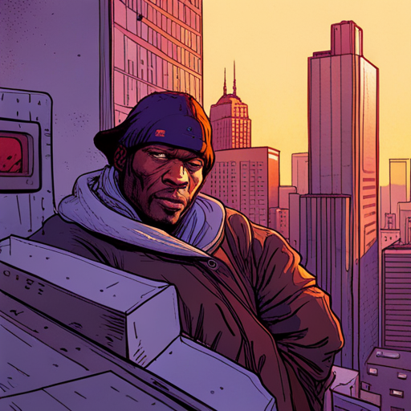

  
[jamal] pulls out an old photo of him and his girlfriend

  32, burly, black, doo rag, tats, a scar on his neck — a hooded cross between 50 Cent and Mike Tyson pulls out an old photo of him and his girlfriend

Jamal pulls out an old photo of him and his girlfriend. In his denim coat, he, too, finds a snow globe: “Life is like a snow globe - it’s most beautiful when shaken up.”

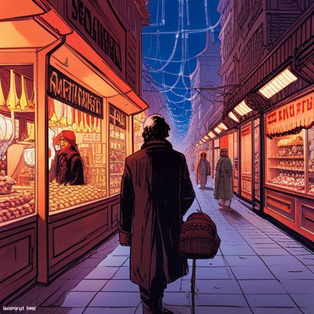

  
[Jamal] walks through a BAZAAR with CHRISTMAS LIGHTS strung up over WET MARKETS and RATIONING BOOTHS.

  [Jamal] walks through a BAZAAR with CHRISTMAS LIGHTS strung up over WET MARKETS and RATIONING BOOTHS.

He walks through a BAZAAR with CHRISTMAS LIGHTS strung up over WET MARKETS and RATIONING BOOTHS.

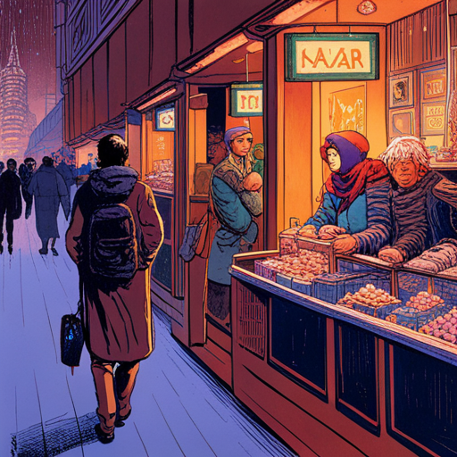

  
[Jamal] walks through a BAZAAR with CHRISTMAS LIGHTS strung up over WET MARKETS and RATIONING BOOTHS.

  [Jamal] walks through a BAZAAR with CHRISTMAS LIGHTS strung up over WET MARKETS and RATIONING BOOTHS.

A troupe of Mexican performers hunched over dressed in sombreros with streamers, ponchos and masks stomp their feet and canes in a rhythmic do-si-do dance to the beat.

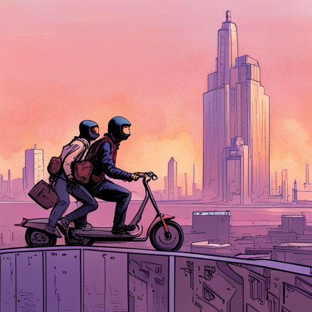

  
A HOVER SCOOTER gang on floating skateboards prowl through the smog looking for victims to rob

  A HOVER SCOOTER gang on floating skateboards prowl through the smog looking for victims to rob

A HOVER SCOOTER gang, led by a thug with a checkerboard face tattoo, prowls through the smog looking for victims.

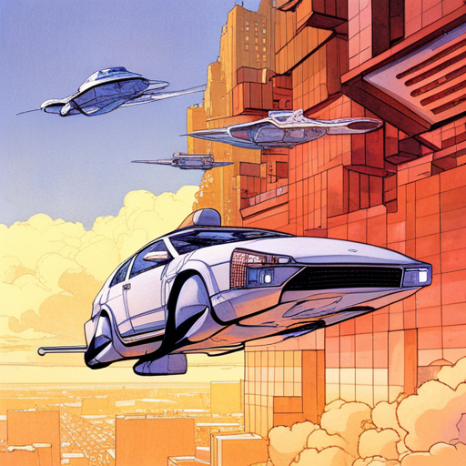

  
[Jamal] iooks up at the [jumpers] in the sky

  [Jamal] iooks up at the futuristic hover cars flying through the sky in the sky

Jamal is amazed at the Jumpers in the sky. A lot has changed in the ten years he was inside.

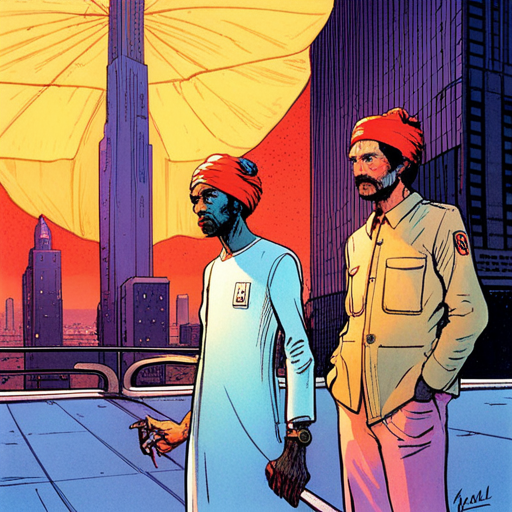

  
Jamal is approached by two DRUG DEALERS who wear large turbans and twirl glowing umbrellas that illuminate their ghoulish faces.

  Jamal is approached by two DRUG DEALERS who wear large turbans and twirl glowing umbrellas that illuminate their ghoulish faces.

Two turban-wearing DRUG DEALERS twirl glowing umbrellas that illuminate their ghoulish faces. One opens up his trench coat and reveals drugs. Jamal snatches the bag but doesn’t pay. He’s too big to stop.

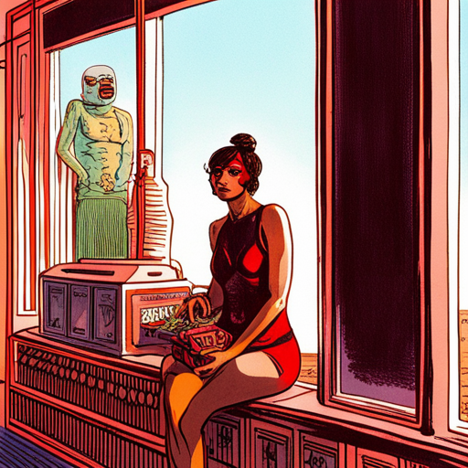

  
A scantily-clad mask-wearing lady sells betel nuts from a neon-lit glass kiosk

  A scantily-clad mask-wearing lady sells betel nuts from a neon-lit glass kiosk

A scantily-clad, mask-wearing lady sells betel nuts from a neon-lit glass kiosk. She beckons a passing Jamal.

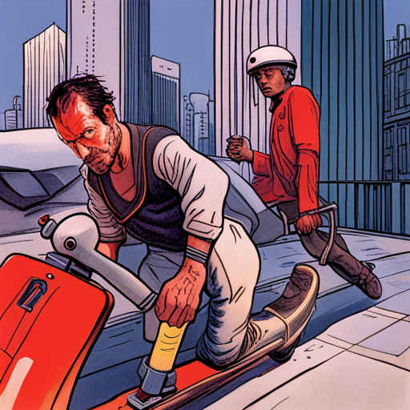

  
Jamal violently clotheslines a thug with a checkerboard face tattoo on a hover scooter

  Jamal violently clotheslines a thug with a checkerboard face tattoo on a hover scooter

The checkerboard face thug snatches the purse from the betel nut girl. Jamal violently clotheslines him in one motion. Jamal tosses the purse back to the girl then strips the thug of his Money Green Chinchilla fur jacket.

# Board meeting 

  
[monocorp-penthouse] exterior shot

  [monocorp-penthouse] exterior shot

  
board members

  [boardMembers] singing and dancing

BOARD MEMBERS (20s-50s, mix genders and ethnicities, epitomizing corporate cool with deadpan stares, smoldering gazes and perfectly coiffed hair) dance

  
Monocorp's Board celebrate their growing global control

  [boardMembers] remove their hooded robes to reveal power suits

They remove their hooded robes to reveal power suits. They dance in unison in front of a raised stage surrounded by video screens

  
[boardMembers] looking at a presentation of pie charts on a big screen, showing financial success.

  [boardMembers] looking at a presentation of pie charts on a big screen, showing financial success.

VIDEO: Revenue numbers and pie charts highlighting Monocorp’s financial success flash on screen.

# Hadji 

  
[hadji] is strung out, depressed, — smoking and drinking from a huka in a huka bar.

  26, swarthy, angsty, nihilistic heart throb. He wears a black duster that reveals his bare chest, long hair, beard, goth necklaces, facial piercings, and dark eye liner. He’s strung out — smoking and drinking from a sake flask. is strung out, depressed, — smoking and drinking from a huka in a huka bar.

He’s strung out — smoking and drinking from a sake flask.

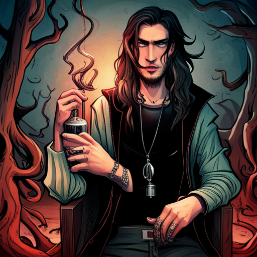

  
[hadji] holds up a playing card and - sleight of hand - it disappears

  26, swarthy, angsty, nihilistic heart throb. He wears a black duster that reveals his bare chest, long hair, beard, goth necklaces, facial piercings, and dark eye liner. He’s strung out — smoking and drinking from a sake flask. holds up a playing card and - sleight of hand - it disappears

He holds up a card and - sleight of hand - it disappear.

Hadji: For my next trick, I’ll need a condom and a female volunteer.

The groupie slips a snow globe into Hadji’s coat.

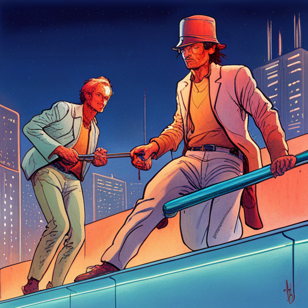

  
Two bar guards drag Hadji out of the club

  Two bar guards drag [Hadji] out of the club

Two guards tap their PAL headpieces and pick up Hadji, and drag him to the Jumper outside.

# SSS-Scene 

Tiara ducks inside.

# Hadji 

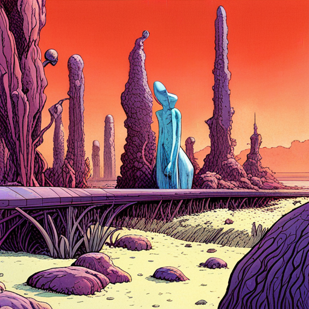

  
The club features a cheaply designed fiberglass, foam alien garden set design. It’s a faux bio-luminescent grassland teeming with “exotic” plants and underwater coral reefs and plankton. More depressing than magical.

  The club features a cheaply designed fiberglass, foam alien garden set design. It’s a faux bio-luminescent grassland teeming with “exotic” plants and underwater coral reefs and plankton. More depressing than magical.

The club features a cheaply designed fiberglass, foam alien garden set design. It’s a faux bio-luminescent grassland teeming with “exotic” plants and underwater coral reefs and plankton. More depressing than magical.

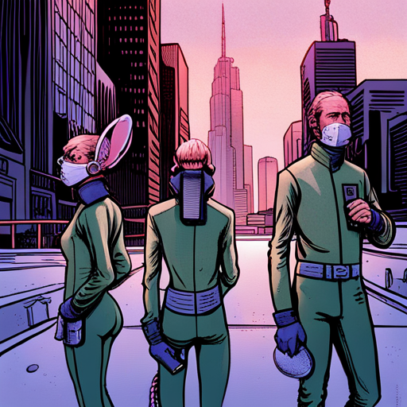

  
The club’s scruffy, ragtag cosplay performers wear green screen suits with surgical gloves, respiratory masks and minimal costume accessories: ears, butt plugs attached to rubber tails, alien headgear, strap-on dildos and artificial pussies.

  The club’s scruffy, ragtag cosplay performers wear green screen suits with surgical gloves, respiratory masks and minimal costume accessories: ears, rubber tails, alien headgear

The club’s scruffy, ragtag performers - most likely sex workers - wear green screen suits with surgical gloves, respiratory masks and minimal costume accessories: ears, butt plugs attached to rubber tails, alien headgear, strap-on dildos and artificial pussies.

An avatar RINGMASTER (30s, man, handsome wearing red tail coat with chain closure, vest dickey with attached bow tie, top hat) appears and hypes the lonesome crowd.

The PROPRIETOR (THAI LADYBOY, 30s, beautiful) hands Tiara an old Oculus-like tech headset like loaner shoes at a bowling alley.

The DJ (20-something, tall, piercing blue eyes and long hair) put a needle on the record. He stares at Tiara.
Together the performers dance and sing a sorta Lady Marmalade-like anthem that belies their weariness and despair.

From the POV of the AR headset, the club’s crude sets transform into something magical, and shaggy cosplay performers now appear as fully-realized anthropomorphic animals, avatars, aliens, and anime characters. It’s like a perverse cartoon that’s magnificently come to life!

actor: California rocks like Bangkok!

Without the headset (a true case of rose-colored glasses) Tiara watches the cold reality of jaded performers giving perfunctory lap dances and gloved hand jobs to the sad and lonely headset-wearing female and male patrons - miserable social outliers you might find in a strip club.

# ConferenceRoom 

Tiara, Hadji and Jamal sit eyeing each other.

Jamal has his feet up on the table with a joint in his mouth. His face is partially hidden in shadows.

Hadji drinks from his flask.

Tiara, still in sunglasses, taps her leg, lights a cigarette and - with a french inhale - starts the convo.

Tiara: I hope this doesn't take long. I'm in the middle of shooting.

Jamal: Shooting? I thought poison was your “trade murk”.

Tiara: Excuse me? You know me?

Jamal leans forward into the light, gold tooth gleaming.

Jamal: I know ya moved grande dame’s name from the marquee to a tombstone. Changed her wonderful life from an “is” to a “was”.

