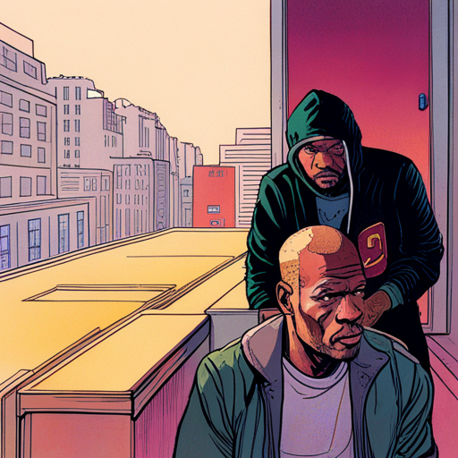
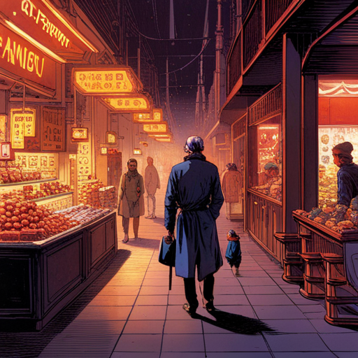
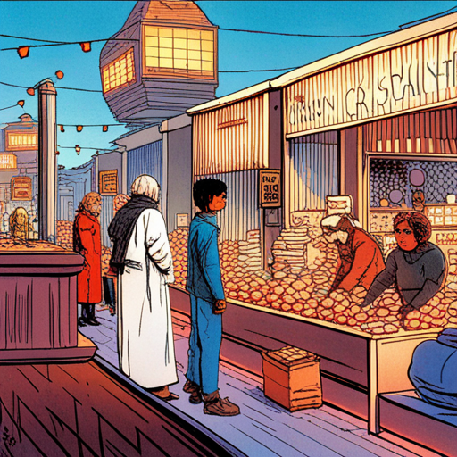
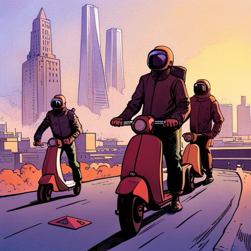
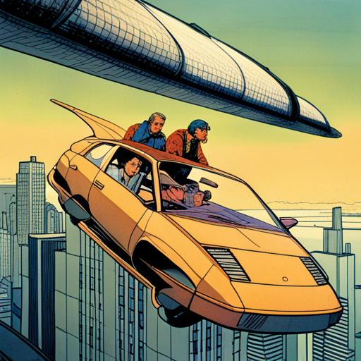

# Story

styleName: retroFuture

styleValue: cover illustration for a graphic novel by Jean Giraud Moebius, the Incal, by Syd Mead. retro future stylish drawing

# Ginger Intro 

Ginger takes a huff on her cigarette and looks around

  
at [hosExt] portrait of [ginger] smoking a cigarette

  at In front of the building’s Art Deco rotunda and towering curved facade, a media circus of paparazzi, reporters and fans gather behind barricades. portrait of [ginger] smoking a cigarette

> Tiara: hi Malika

Ginger leaves the courtroom in a huff, flanked by her lawyers.

  
[ginger] flanked by her lawyers

  [ginger] flanked by her lawyers

Ginger is met with screams and heckles.

  
[ginger] at the [hosSteps] surrounded by reporters and paparazzi photographers

  [ginger] at the The steps of the Hall of Justice surrounded by reporters and paparazzi photographers

She pushes past her two lawyers to a mic-covered podium. Hecklers boo. Her lawyers

> Tiara: Move over, boys. They want to see me.

Ginger blows kisses to hecklers as she descends the stairs to a waiting shimmering gold Monocorp JUMPER — an autonomous quadcopter VTOL passenger drone covered in a matrix of marquee bulbs that move in abstract patterns. futuristic film noir anime comic book high contrast illustration

Ginger signs an autograph for a young seeker, who - in the chaos - is left holding Ginger’s lit cigarette.

  
[ginger] at the [hosSteps] signing an autograph

  [ginger] at the The steps of the Hall of Justice signing an autograph

# Hopper 1 

  
Snow spirals down from the heavens on the iconic CAPITOL RECORDS BUILDING in Los Angeles.

  Snow spirals down from the heavens on the iconic CAPITOL RECORDS BUILDING in Los Angeles.

  
a mysterious person in a velvet hooded robe holds a snow globe in the palm of their hand. inside the snow globe is the iconic CAPITOL RECORDS BUILDING.

  a mysterious person in a velvet hooded robe holds a snow globe in the palm of their hand. inside the snow globe is the iconic CAPITOL RECORDS BUILDING.

  
CAPITOL RECORDS TOWER - decrepit and abandoned - leans precariously in the background.

  CAPITOL RECORDS TOWER - decrepit and abandoned - leans precariously in the background.

# Jamal 

Jamal pulls out an old photo of him and his girlfriend. In his denim coat, he, too, finds a snow globe: “Life is like a snow globe - it’s most beautiful when shaken up.”

  
[jamal] pulls out an old photo of him and his girlfriend

  32, burly, black, doo rag, tats, a scar on his neck — a hooded cross between 50 Cent and Mike Tyson pulls out an old photo of him and his girlfriend

He walks through a BAZAAR with CHRISTMAS LIGHTS strung up over WET MARKETS and RATIONING BOOTHS.

  
[Jamal] walks through a BAZAAR with CHRISTMAS LIGHTS strung up over WET MARKETS and RATIONING BOOTHS.

  [Jamal] walks through a BAZAAR with CHRISTMAS LIGHTS strung up over WET MARKETS and RATIONING BOOTHS.

A troupe of Mexican performers hunched over dressed in sombreros with streamers, ponchos and masks stomp their feet and canes in a rhythmic do-si-do dance to the beat.

  
[Jamal] walks through a BAZAAR with CHRISTMAS LIGHTS strung up over WET MARKETS and RATIONING BOOTHS.

  [Jamal] walks through a BAZAAR with CHRISTMAS LIGHTS strung up over WET MARKETS and RATIONING BOOTHS.

A HOVER SCOOTER gang, led by a thug with a checkerboard face tattoo, prowls through the smog looking for victims.

  
A HOVER SCOOTER gang on floating skateboards prowl through the smog looking for victims to rob

  A HOVER SCOOTER gang on floating skateboards prowl through the smog looking for victims to rob

Jamal is amazed at the Jumpers in the sky. A lot has changed in the ten years he was inside.

  
[Jamal] iooks up at the [jumpers] in the sky

  [Jamal] iooks up at the futuristic hover cars flying through the sky in the sky

