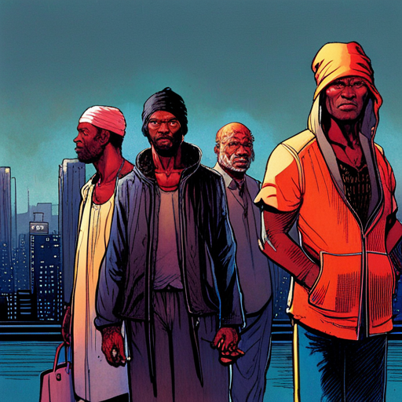
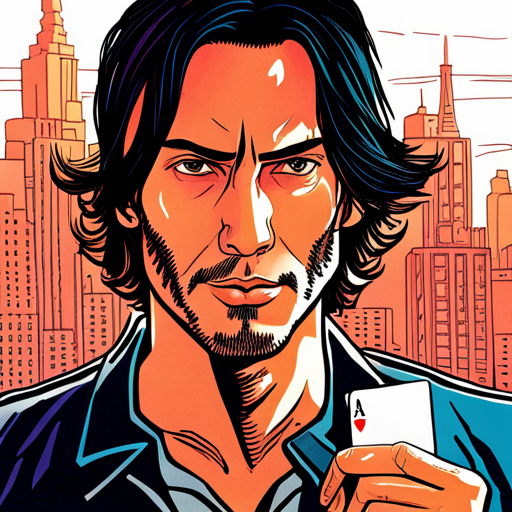

# Story

styleName: retrofuture

styleValue: cover illustration for a graphic novel by Jean Giraud Moebius, the Incal, by Syd Mead. retro future stylish drawing

# Opening Scene 

Snow spirals down from the heavens on the iconic CAPITOL RECORDS BUILDING in Los Angeles.

  
Snow spirals down from the heavens on the iconic CAPITOL RECORDS BUILDING in Los Angeles.

  Snow spirals down from the heavens on the iconic CAPITOL RECORDS BUILDING in Los Angeles.

  
a mysterious person in a velvet hooded robe holds a [snowcapitol] in the palm of their hand.

  a mysterious person in a velvet hooded robe holds a snowglobe of capitol records building in the palm of their hand.

  
CAPITOL RECORDS TOWER - decrepit and abandoned - leans precariously in the background.

  CAPITOL RECORDS TOWER - decrepit and abandoned - leans precariously in the background.

  
Hollywood is burning

  trees and neighborhoods of Hollywood Hills and Hollywood Sign are on fire.

# tiara Intro 

# Opening Scene 

  
Tiara takes a huff on her cigarette and looks around

  portrait of early 30s ethnically ambiguous woman in a red dress wearing Jackie Onassis sunglasses smoking a cigarette

tiara leaves the courtroom in a huff, flanked by her lawyers.

  
[tiara] flanked by her lawyers

  early 30s ethnically ambiguous woman in a red dress wearing Jackie Onassis sunglasses flanked by her lawyers

tiara is met with screams and heckles.

  
[tiara] surrounded by reporters and paparazzi photographers

  early 30s ethnically ambiguous woman in a red dress wearing Jackie Onassis sunglasses surrounded by reporters and paparazzi photographers

She pushes past her two lawyers to a mic-covered podium. Hecklers boo. Her lawyers

  
[tiara] pushes past her two lawyers to a mic-covered podium.

  early 30s ethnically ambiguous woman in a red dress wearing Jackie Onassis sunglasses pushes past her two lawyers to a mic-covered podium.

> Tiara: Move over, boys. They want to see me.

tiara blows kisses to hecklers as she descends the stairs to a waiting shimmering gold Monocorp JUMPER — an autonomous quadcopter VTOL passenger drone covered in a matrix of marquee bulbs that move in abstract patterns. futuristic film noir anime comic book high contrast illustration

  
[tiara] walks to a [jumper] waiting for her at the bottom of the stairs

  early 30s ethnically ambiguous woman in a red dress wearing Jackie Onassis sunglasses walks to a futuristic scifi quad copter hover cars flying in the sky waiting for her at the bottom of the stairs

tiara signs an autograph for a young seeker, who - in the chaos - is left holding tiara’s lit cigarette.

  
[tiara] at the [hosSteps] signing an autograph

  early 30s ethnically ambiguous woman in a red dress wearing Jackie Onassis sunglasses at the [hosSteps] signing an autograph

# Jamal 

Jamal pulls out an old photo of him and his girlfriend. In his denim coat, he, too, finds a snow globe: “Life is like a snow globe - it’s most beautiful when shaken up.”

  
[jamal] pulls out an old photo of him and his girlfriend

  32, burly, black, doo rag, tats, a scar on his neck — a hooded cross between 50 Cent and Mike Tyson pulls out an old photo of him and his girlfriend

He walks through a BAZAAR with CHRISTMAS LIGHTS strung up over WET MARKETS and RATIONING BOOTHS.

  
[jamal] walks through a BAZAAR with CHRISTMAS LIGHTS strung up over WET MARKETS and RATIONING BOOTHS.

  32, burly, black, doo rag, tats, a scar on his neck — a hooded cross between 50 Cent and Mike Tyson walks through a BAZAAR with CHRISTMAS LIGHTS strung up over WET MARKETS and RATIONING BOOTHS.

A troupe of Mexican performers hunched over dressed in sombreros with streamers, ponchos and masks stomp their feet and canes in a rhythmic do-si-do dance to the beat.

  
A troupe of Mexican performers hunched over dressed in sombreros with streamers, ponchos and masks stomp their feet and canes in a rhythmic do-si-do dance to the beat.

  A troupe of Mexican performers hunched over dressed in sombreros with streamers, ponchos and masks stomp their feet and canes in a rhythmic do-si-do dance to the beat.

A HOVER SCOOTER gang, led by a thug with a checkerboard face tattoo, prowls through the smog looking for victims.

  
A HOVER SCOOTER gang on floating skateboards prowl through the smog looking for victims to rob

  A HOVER SCOOTER gang on floating skateboards prowl through the smog looking for victims to rob

Jamal is amazed at the Jumpers in the sky. A lot has changed in the ten years he was inside.

  
A lot has changed in ten years

  32, burly, black, doo rag, tats, a scar on his neck — a hooded cross between 50 Cent and Mike Tyson iooks up at the futuristic scifi quad copter hover cars flying in the sky flying overhead

Two turban-wearing DRUG DEALERS twirl glowing umbrellas that illuminate their ghoulish faces. One opens up his trench coat and reveals drugs. Jamal snatches the bag but doesn’t pay. He’s too big to stop.

  
Let the party begin

  32, burly, black, doo rag, tats, a scar on his neck — a hooded cross between 50 Cent and Mike Tyson is approached by two DRUG DEALERS who wear large turbans and twirl glowing umbrellas that illuminate their ghoulish faces.

A scantily-clad, mask-wearing lady sells betel nuts from a neon-lit glass kiosk. She beckons a passing Jamal.

  
pussy come free

  A scantily-clad mask-wearing lady sells betel nuts from a neon-lit glass kiosk

The checkerboard face thug snatches the purse from the betel nut girl. Jamal violently clotheslines him in one motion. Jamal tosses the purse back to the girl then strips the thug of his Money Green Chinchilla fur jacket.

  
checkmate, mutha fucka

  32, burly, black, doo rag, tats, a scar on his neck — a hooded cross between 50 Cent and Mike Tyson hits a tattooed thug on a hover scooter

# Annual Board Meeting 

  
exterior shot

  exterior shot

BOARD MEMBERS (20s-50s, mix genders and ethnicities, epitomizing corporate cool with deadpan stares, smoldering gazes and perfectly coiffed hair) dance

  
Monocorp is worth more than Apple, Google and Musk combined

  [boardMembers] singing and dancing

They remove their hooded robes to reveal power suits. They dance in unison in front of a raised stage surrounded by video screens

  
Monocorp's Board celebrate their growing global control

  [boardRoomInt] [boardMembers] dressed in power suits

VIDEO: Revenue numbers and pie charts highlighting Monocorp’s financial success flash on screen.

  
[boardMembers] looking at a presentation of pie charts on a big screen, showing financial success.

  [boardMembers] looking at a presentation of pie charts on a big screen, showing financial success.

# Hadji 

He’s strung out — smoking and drinking from a sake flask.

  
Playboy in the opium den

  swarthy, angsty, nihilistic heart throb, handsome Indian Keanu Reeves-looking young man is strung out, depressed smoking and drinking from a huka in a huka bar.

He holds up a card and - sleight of hand - it disappear.

  
[hadji] holds up a playing card

  swarthy, angsty, nihilistic heart throb, handsome Indian Keanu Reeves-looking young man holds up a playing card

  
The mourning maharashi

  swarthy, angsty, nihilistic heart throb, handsome Indian Keanu Reeves-looking young man but the playing card has disappeared

> Hadji: For my next trick, I’ll need a condom and a female volunteer.

The groupie slips a snow globe into Hadji’s coat.

Two guards tap their PAL headpieces and pick up Hadji, and drag him to the Jumper outside.

  
Two bar guards drag Hadji out of the club

  Two bar guards drag swarthy, angsty, nihilistic heart throb, handsome Indian Keanu Reeves-looking young man out of the club

# SSS-Scene 

Tiara ducks inside.

# Hadji 

The club features a cheaply designed fiberglass, foam alien garden set design. It’s a faux bio-luminescent grassland teeming with “exotic” plants and underwater coral reefs and plankton. More depressing than magical.

  
The club features a cheaply designed fiberglass, foam alien garden set design. It’s a faux bio-luminescent grassland teeming with “exotic” plants and underwater coral reefs and plankton. More depressing than magical.

  The main set design features faux bio-luminescent grassland teeming with “exotic” plants and underwater coral reefs and plankton. More depressing than magical.

The club’s scruffy, ragtag performers - most likely sex workers - wear green screen suits with surgical gloves, respiratory masks and minimal costume accessories: ears, butt plugs attached to rubber tails, alien headgear, strap-on dildos and artificial pussies.

  
The club’s scruffy, ragtag cosplay performers wear green screen suits with surgical gloves, respiratory masks and minimal costume accessories: ears, butt plugs attached to rubber tails, alien headgear, strap-on dildos and artificial pussies.

  The club’s scruffy, ragtag cosplay performers wear green screen suits with surgical gloves, respiratory masks and minimal costume accessories: ears, rubber tails, alien headgear

An avatar RINGMASTER (30s, man, handsome wearing red tail coat with chain closure, vest dickey with attached bow tie, top hat) appears and hypes the lonesome crowd.

  
Welcome to the Siamese Sex Show

  A ringmaster hypes the lonely crowd

> actor: Welcome to the Siamese Sex Show - the best sex you’ll never have. Escape into a fantasy of your own creation. You’re gonna cum - we guarantee it.

The PROPRIETOR (THAI LADYBOY, 30s, beautiful) hands Tiara an old Oculus-like tech headset like loaner shoes at a bowling alley.

  
The PROPRIETOR (THAI LADYBOY, 30s, beautiful) hands Tiara an old Oculus-like tech headset like loaner shoes at a bowling alley.

  The PROPRIETOR (THAI LADYBOY, 30s, beautiful) hands Tiara an old Oculus-like tech headset like loaner shoes at a bowling alley.

The DJ (20-something, tall, piercing blue eyes and long hair) put a needle on the record. He stares at Tiara.
Together the performers dance and sing a sorta Lady Marmalade-like anthem that belies their weariness and despair.

  
The DJ (20-something, tall, piercing blue eyes and long hair) put a needle on the record. He stares at Tiara.
Together the performers dance and sing a sorta Lady Marmalade-like anthem that belies their weariness and despair.

  The DJ (20-something, tall, piercing blue eyes and long hair) put a needle on the record. He stares at Tiara.
Together the performers dance and sing a sorta Lady Marmalade-like anthem that belies their weariness and despair.

From the POV of the AR headset, the club’s crude sets transform into something magical, and shaggy cosplay performers now appear as fully-realized anthropomorphic animals, avatars, aliens, and anime characters. It’s like a perverse cartoon that’s magnificently come to life!

> actor: California rocks like Bangkok!

Without the headset (a true case of rose-colored glasses) Tiara watches the cold reality of jaded performers giving perfunctory lap dances and gloved hand jobs to the sad and lonely headset-wearing female and male patrons - miserable social outliers you might find in a strip club.

# ConferenceRoom 

Tiara, Hadji and Jamal sit eyeing each other.

Jamal has his feet up on the table with a joint in his mouth. His face is partially hidden in shadows.

Hadji drinks from his flask.

Tiara, still in sunglasses, taps her leg, lights a cigarette and - with a french inhale - starts the convo.

> Tiara: I hope this doesn't take long. I'm in the middle of shooting.

> Jamal: Shooting? I thought poison was your “trade murk”.

> Tiara: Excuse me? You know me?

Jamal leans forward into the light, gold tooth gleaming.

> Jamal: I know ya moved grande dame’s name from the marquee to a tombstone. Changed her wonderful life from an “is” to a “was”.

